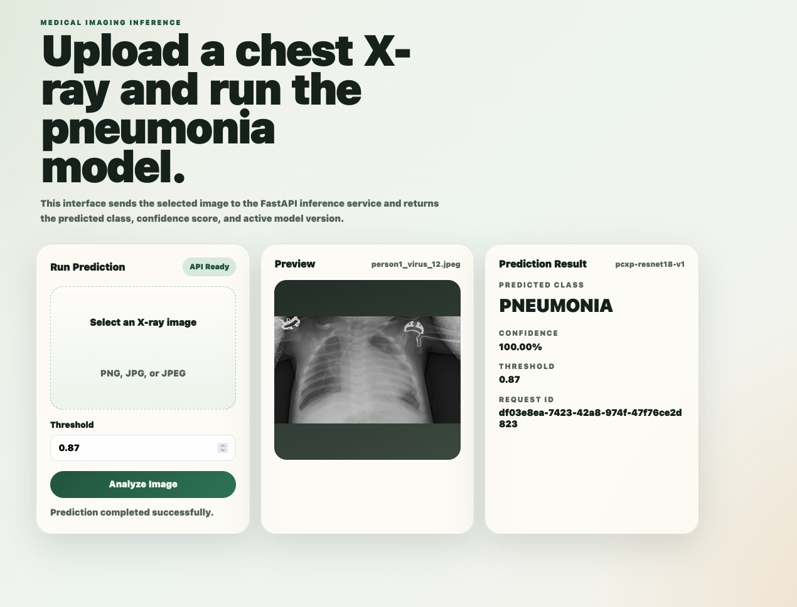

# PCXP Pneumonia Detection – MLOps Pipeline

A complete MLOps pipeline for pneumonia detection from chest X-ray images, from exploratory analysis to production deployment with a REST API and Docker. 

---

## Project Overview

This project implements a binary image classifier (NORMAL vs PNEUMONIA) using a **ResNet18** convolutional neural network trained on the **PCXP chest X-ray dataset**. The workflow follows the 10-stage pipeline defined in the roadmap:

| Stage | Phase | Description |
|-------|-------|-------------|
| 1 | EDA | Explore raw data, understand structure, identify issues |
| 2 | Preprocessing | Clean & transform images (resize, normalize, augment) |
| 3 | Modelling | Train & optimise ResNet18, SVM baseline, XGBoost baseline |
| 4 | Code structure | Modular Python package (`python/pcxp_mlops/`) |
| 5 | Tests | Unit & functional tests for pipeline components |
| 6 | DVC | Data versioning with DVC pipeline |
| 7 | MLflow | Experiment tracking – hyperparams, metrics, artefacts |
| 8 | API | REST service exposing the trained model |
| 9 | Docker | Containerised deployment |
| 10 | GitHub | Version control, structured repo, documentation |

---

## Showcase



The API serves an interactive web interface at `/` where you can upload a chest X-ray, adjust the confidence threshold, and view the prediction alongside model version and request metadata.

---

## Project Structure

```
.
├── python/
│   ├── api.py                    # ASGI entrypoint
│   ├── train.py                  # Training CLI
│   ├── evaluate.py               # Evaluation CLI
│   └── pcxp_mlops/
│       ├── api.py                # FastAPI app factory & endpoints
│       ├── config.py             # Centralised paths & constants
│       ├── data_loader.py        # Image loading & transforms
│       ├── evaluation.py         # Evaluation & MLflow logging
│       ├── metadata.py           # Model metadata persistence
│       ├── metrics.py            # Metric helpers
│       ├── model.py              # ResNet18 model factory
│       ├── predict.py            # Inference service
│       ├── training.py           # Training loop
│       └── static/               # Web UI (HTML, CSS, JS)
├── models/
│   ├── metadata.json             # Model version & metrics
│   ├── classes.json              # Class label order
│   └── model.pth                 # Trained weights
├── tests/
│   ├── test_api.py
│   └── test_ml_pipeline.py
├── data/                         # DVC-tracked dataset
├── Dockerfile
├── docker-compose.yml
├── dvc.yaml                      # DVC pipeline definition
├── requirements.txt
└── roadmap.txt
```

---

## API

The REST API is built with **FastAPI** and exposes the following endpoints:

### `GET /`
Serves the browser interface for image upload and interactive inference.

### `GET /health`
Returns API status and active model version.

```json
{
  "status": "ok",
  "model_version": "pcxp-resnet18-v1",
  "model_path": "/app/models/model.pth"
}
```

### `GET /model-info`
Returns full model metadata, metrics, class names, and artefact presence.

### `POST /predict`
Accepts a chest X-ray image (file path or base64) and returns the prediction.

**Request:**
```json
{
  "image_path": "data/PCXP/test/PNEUMONIA/person100_bacteria_475.jpeg"
}
```

**Response:**
```json
{
  "request_id": "7f0d5d1c-8c8d-44c4-8687-7e4f0d7d6f13",
  "predicted_class": "PNEUMONIA",
  "predicted_index": 1,
  "probability": 0.97,
  "threshold": 0.87,
  "model_version": "pcxp-resnet18-v1"
}
```

You may also send `image_base64` (base64-encoded image string) instead of `image_path`, and optionally override the decision `threshold` (0.0–1.0).

---

## Docker

### Build the image

```bash
docker build -t pcxp-api .
```

### Run with Docker

```bash
docker run --rm -p 8000:8000 -v "$(pwd)/models:/app/models" pcxp-api
```

### Run with Docker Compose

```bash
docker compose up --build
```

The Compose setup mounts `./models` as a volume, exposes port 8000, and sets the required environment variables.

---

## Local Usage

### Install dependencies

```bash
pip install -r requirements.txt
```

### Train the model

```bash
python -m python.train
```

### Evaluate the saved model

```bash
python -m python.evaluate
```

### Run the API

```bash
uvicorn python.api:app --host 0.0.0.0 --port 8000
```

### Run tests

```bash
python -m unittest discover -s tests
```

---

## DVC Pipeline

The dataset is versioned with DVC. The pipeline (`dvc.yaml`) defines two stages:

- **train** – depends on training data + source code; produces model weights, classes, and metadata.
- **evaluate** – depends on test data + model; updates metadata with evaluation metrics.

Reproduce the full pipeline:

```bash
dvc repro
```

---

## MLflow

Experiments are logged with MLflow during evaluation. Launch the UI to compare runs:

```bash
mlflow ui
```

---

## Tech Stack

- **PyTorch** & **Torchvision** – deep learning framework
- **FastAPI** & **Uvicorn** – REST API
- **DVC** – data versioning
- **MLflow** – experiment tracking
- **Docker** & **Docker Compose** – containerisation
- **scikit-learn** – baseline models & metrics
- **pytest** – automated testing
